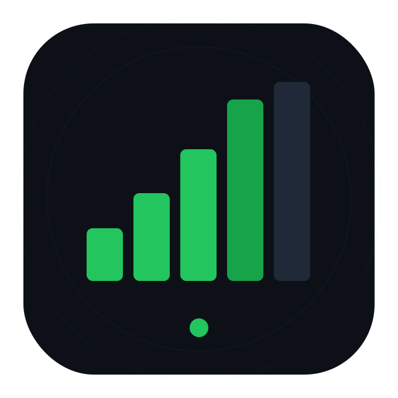

<p>
  
</p>

## Welcome to netbar!

`netbar` is a small terminal connectivity monitor for AI CLI workflows and long-running terminal sessions.

It keeps a network status signal visible while you work, so when a command appears stuck you can quickly tell whether the issue is the tool or the connection.

See:

- the [installation guide](Installation);
- the [usage guide](Usage);
- the [session mode guide](Session-Mode);
- the [AI CLI workflow guide](AI-CLI-Workflows);
- and the [troubleshooting guide](Troubleshooting).

## What netbar Shows

- `Online`: DNS and TCP checks are passing.
- `Degraded`: checks pass, but TCP latency is above the degraded threshold.
- `Offline`: DNS or TCP checks fail.
- `Back online`: the network recovered after an offline or degraded state.

## Common Uses

- Run a shell with a bottom network status row.
- Run Codex or another AI CLI inside a status-aware terminal session.
- Print one-shot status output for terminal prompts, scripts, or status bars.
- Render a tmux-compatible status segment.

## Quick Start

Install or upgrade:

```sh
go install github.com/heismyke/netbar/cmd/netbar@latest
```

Open a netbar session:

```sh
netbar
```

Run Codex inside netbar:

```sh
netbar -- codex
```

Run one check and exit:

```sh
netbar -once
```

## Important Behavior

`netbar` cannot draw underneath an already-running terminal application from the outside.

To show the status row beneath Codex, start Codex through netbar:

```sh
netbar -- codex
```

This lets netbar own the terminal session, reserve the bottom row, and redraw the network status while the wrapped command runs.

## Project Links

- Repository: https://github.com/heismyke/netbar
- Releases: https://github.com/heismyke/netbar/releases
- License: MIT
